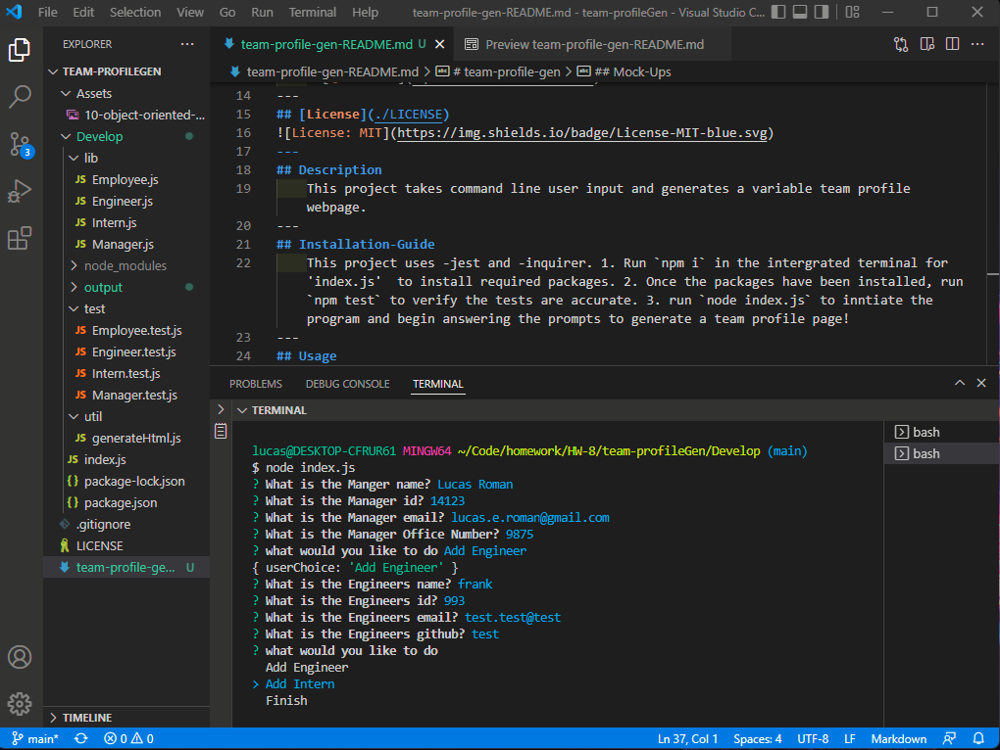

# team-profile-gen

## Table of Contents
   1. [License](#license)
   2. [Project-Description](#description)
   3. [Installation-Guide](#installation-guide)
   4. [Project-Usage](#usage)
   5. [Project-Contributors](#contributors)
   6. [Project-Tests](#tests)
   7. [Links](#links)
   8. [Mock-Ups](#mock-ups)
   9. [Questions](#questions-contact-me-at)
--- 
## [License](./LICENSE)

---
## Description 
    This project takes command line user input and generates a variable team profile webpage. 
---
## Installation-Guide
    This project uses -jest and -inquirer. 1. Run `npm i` in the intergrated terminal for 'index.js'  to install required packages. 2. Once the packages have been installed, run `npm test` to verify the tests are accurate. 3. run `node index.js` to inntiate the program and begin answering the prompts to generate a team profile page! 
---
## Usage 
    To generate a team profile page that is styled 
---
## Contributors
    n/a
---
## Tests
    4 tests have been written to check for response format. 
---
## Links
#### https://github.com/remotemana/team-profileGen | https://drive.google.com/file/d/1TZllp8ILKnIf5nUNZ80lCILPO-gZOvN3/view
---
## Mock-Ups

## Questions? Contact Me at...
lucas.e.roman@gmail.com | [github.com](https://github.com/remotemana)
